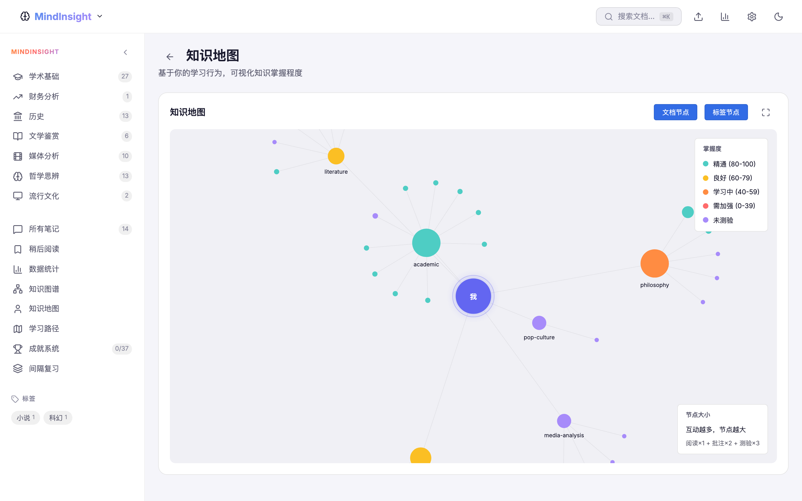
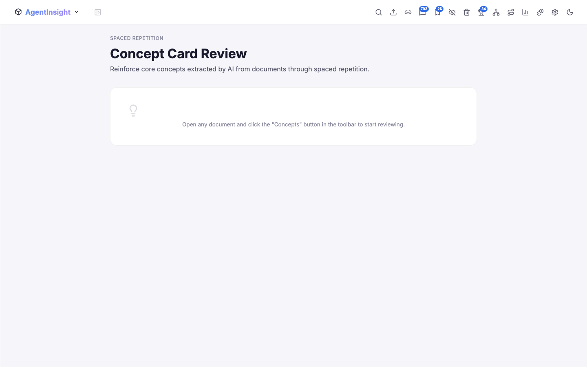
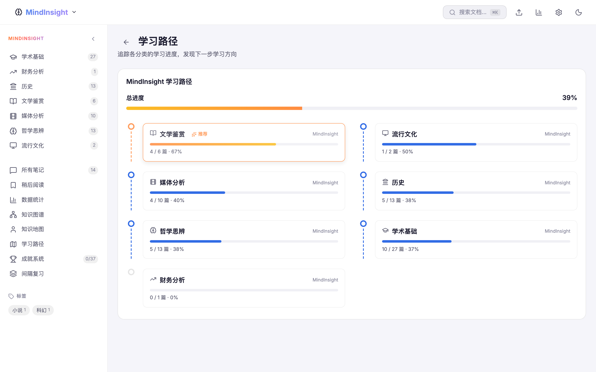
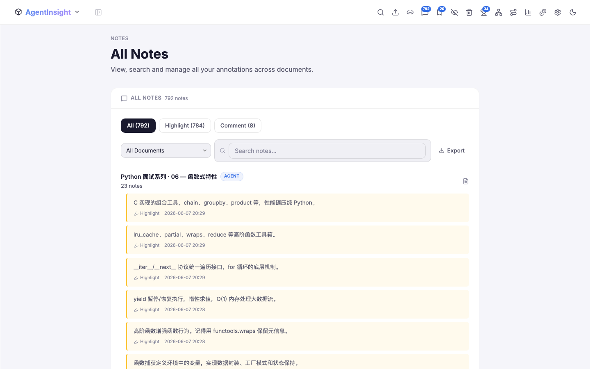

# InsightHub

An intelligent knowledge management platform for browsing, annotating, and mastering HTML learning documents. Powered by local LLM integration for AI-generated quizzes and document summaries, with rich interactive visualizations and science-backed spaced repetition.

## Screenshots

<p align="center">
  
  
</p>
<p align="center">
  <em>Home Dashboard</em> — stats, recent reads, and category overview<br/>
  <em>Document Reader</em> — iframe embed with annotation highlights
</p>

<p align="center">
  
  
</p>
<p align="center">
  <em>Knowledge Graph</em> — interactive D3-force document network<br/>
  <em>Personal Map</em> — your knowledge landscape, color-coded by mastery
</p>

<p align="center">
  
  
</p>
<p align="center">
  <em>Learning Analytics</em> — heatmap, radar, quiz dashboard<br/>
  <em>Spaced Repetition</em> — AI flashcards with SM-2 scheduling
</p>

<p align="center">
  
  
</p>
<p align="center">
  <em>Learning Path</em> — milestones with progress and recommendations<br/>
  <em>Notes</em> — all annotations grouped by document
</p>

## Highlights

### AI-Powered Learning

InsightHub integrates with any OpenAI-compatible local LLM to bring intelligence directly into your reading workflow:

- **AI Quiz Generation** — Select any document and generate a complete quiz session on the fly. The LLM analyzes the document content and produces multiple-choice and true/false questions via SSE streaming, so you see questions appear in real-time as they're generated. Supports configurable difficulty and question count.

- **AI Document Summarization** — Get a structured summary of any document with one click. The AI extracts core takeaways, key concepts, and a content outline. Summaries stream in incrementally with markdown rendering.

- **AI Answer Grading** — Short-answer quiz questions are graded by the LLM with detailed feedback, explaining why an answer is correct or incorrect.

- **Privacy-First** — All AI features run against a local model. No data leaves your machine. Works with llama.cpp, Ollama, vLLM, or any OpenAI-compatible server.

### Interactive Visualizations

InsightHub turns your learning data into actionable visual insights:

- **Knowledge Graph** — A force-directed network graph where documents, categories, and tags are nodes connected by relationships. Pan, zoom, and drag to explore. Click any node to navigate. Built with D3-force simulation.

- **Personal Knowledge Map** — A force-directed graph centered on "You", showing your personal knowledge landscape. Node size reflects engagement depth (reading + annotations + quizzes). Color-coded mastery levels from red (needs work) to cyan (mastered).

- **Knowledge Tree** — A collapsible tree view organizing content by Category → Document → Concept. Documents show read status, concepts show definitions on hover. Provides a structured, hierarchical alternative to the graph view.

- **GitHub-Style Reading Heatmap** — Track daily reading activity over time with a calendar heatmap, just like GitHub's contribution graph. See your reading streaks at a glance.

- **Category Radar Chart** — A radar/spider chart showing your reading distribution across up to 15 categories. Instantly spot which areas you've covered and which you've neglected.

- **Quiz Performance Dashboard** — A circular gauge for average score, difficulty distribution bar chart, and score trend line chart. Track how your quiz performance evolves over time.

- **Reading Habits Analysis** — Discover when you read most with hourly distribution charts, weekday patterns, and streak tracking (current and longest).

- **Tag Cloud** — A dynamic word cloud where tag size and opacity reflect usage frequency. Click any tag to filter documents.

- **Learning Path** — A timeline of learning milestones showing category progress, completion counts, and recommended next steps based on your reading history.

### Spaced Repetition

Turn your highlights and comments into durable knowledge:

- Annotations are **automatically converted** into flashcards — highlights become fill-in-the-blank cards, comments become Q&A cards.
- Reviews are scheduled using the **SM-2 algorithm** (SuperMemo 2), the same proven algorithm behind Anki.
- Intervals grow from 1 day → 6 days → 17 days → 49 days → ... based on your recall performance.
- Grade each card 0-5 (forgot → perfect). Failed cards reset to short intervals.
- 3D flip card animation with keyboard shortcuts (Space to flip, 0-5 to grade, S to skip).
- Workspace-isolated — flashcards are filtered by your current knowledge base.

### Rich Annotation System

- **Highlight** text in 6 colors with persistent overlays that survive page reloads.
- **Comment** on any selection with threaded replies.
- **Click-to-view** — Click any highlighted passage in the document to see its annotation in a popup.
- Annotations are serialized via XPath and restored with fuzzy text matching as fallback, so they survive document edits.
- All annotations are synced across LAN clients.

## Feature Overview

| Category | Features |
|----------|----------|
| **Document Management** | Category browsing, full-text search (FlexSearch), tag filtering, read-later list, document import |
| **AI Integration** | Quiz generation (SSE streaming), document summarization, AI grading, configurable model endpoint |
| **Annotations** | Multi-color highlights, inline comments with replies, click-to-view popup, XPath persistence with fuzzy restore |
| **Spaced Repetition** | Auto flashcard generation, SM-2 scheduling, 3D flip cards, keyboard shortcuts, progress tracking |
| **Visualizations** | Knowledge graph, personal map, knowledge tree, reading heatmap, category radar, quiz dashboard, reading habits, tag cloud, learning path |
| **Gamification** | Achievement system with 20+ unlockable milestones, toast notifications |
| **Data & Sync** | localStorage persistence, LAN sync via REST API, workspace isolation (MindInsight / TechInsight) |
| **UI/UX** | Light/dark theme, responsive sidebar, keyboard shortcuts, iframe-based document reader |

## Tech Stack

| Layer | Technology | Purpose |
|-------|-----------|---------|
| Framework | React 19 + TypeScript | UI and type safety |
| Build | Vite 8 | Dev server and bundling |
| State | Zustand 5 | Lightweight reactive state |
| Search | FlexSearch | Client-side full-text search |
| Charts | Recharts | Statistical charts (radar, heatmap, line, bar) |
| Graph | D3-force | Force-directed graph layouts |
| Icons | Lucide React | Consistent icon system |
| Styling | Pure CSS + Custom Properties | Theming without dependencies |
| AI | OpenAI-compatible SSE | Local LLM integration |

**Zero UI framework dependencies** — no Material UI, no Tailwind, no Bootstrap. Every component is hand-crafted with pure CSS for full control over the design system.

## Quick Start

### Prerequisites

- Node.js >= 18
- A local LLM server (optional, for AI features)

### Install & Run

```bash
cd insighthub
npm install
npm run dev
```

Open `http://localhost:3060`. Document source directories must exist at the paths configured in `vite.config.ts`.

> **Without a local LLM**, the app works fully — browsing, search, annotations, flashcards, and all visualizations function normally. Only AI quiz generation and document summarization require an LLM server.

### Production Build

```bash
npm run build    # Copies documents into public/docs/, type-checks, and bundles
npm run preview  # Serve the production build locally
```

## Project Structure

```
insighthub/
├── src/
│   ├── components/
│   │   ├── DocReader/           # Annotation bar, panel, popup, summary panel
│   │   ├── Layout/              # App shell, sidebar with workspace switching
│   │   ├── visualization/       # 10 interactive visualization components
│   │   │   ├── KnowledgeGraph   #   Force-directed document/category/tag graph
│   │   │   ├── PersonalMap      #   Personal knowledge landscape graph
│   │   │   ├── KnowledgeTree    #   Collapsible category→doc→concept tree
│   │   │   ├── LearningPath     #   Timeline with milestone cards
│   │   │   ├── CategoryRadar    #   Radar chart for category coverage
│   │   │   ├── ReadingHeatmap   #   GitHub-style daily activity heatmap
│   │   │   ├── QuizPerformance  #   Score gauge + trend + difficulty chart
│   │   │   ├── ReadingHabits    #   Hourly/weekday distribution + streaks
│   │   │   ├── TagCloud         #   Frequency-based word cloud
│   │   │   ├── TopEngaged       #   Ranked engagement list
│   │   │   └── ReportHero       #   Summary hero cards for stats page
│   │   └── stats/               # Chart containers and stat components
│   ├── services/
│   │   ├── aiService.ts         # SSE streaming, quiz gen, summarization, grading
│   │   ├── spacedRepetition.ts  # SM-2 algorithm, card creation, HTML stripping
│   │   └── achievementService.ts # 20+ achievement definitions
│   ├── stores/                  # 8 Zustand stores (document, annotation, quiz, etc.)
│   ├── utils/                   # XPath serialization, graph builders, aggregators
│   └── styles/                  # 7 CSS files (globals, layout, components, etc.)
├── vite-plugins/                # Custom Vite plugin (document discovery + API proxy)
└── vite.config.ts
```

## Configuration

### AI Model

Configure from the Settings page or `vite.config.ts`:

```typescript
documentDiscovery({
  aiApiUrl: 'http://127.0.0.1:7001/v1',
  aiModel: 'Qwen/Qwen3.5-27B-4bit',
})
```

Compatible with any OpenAI-compatible server: llama.cpp, Ollama, vLLM, LM Studio, etc.

### Document Sources

Two knowledge bases, each with multiple categories:

| Workspace | Categories |
|-----------|-----------|
| **MindInsight** | Academic, History, Finance, Literature, Media Analysis, Philosophy, Pop Culture |
| **TechInsight** | AI Frameworks, Algorithms, Cloud, Dell, Infrastructure, Job, Programming, VMware |

### Workspace Switching

Toggle between MindInsight and TechInsight from the navbar. Each workspace independently filters documents, annotations, flashcards, tags, and sidebar navigation.

## Documentation

- [DESIGN.md](docs/DESIGN.md) — Technical design, architecture, data flow, algorithms
- [DEPLOY.md](docs/DEPLOY.md) — Build, deployment options (static, LAN, Docker), AI setup

## License

Private project.
