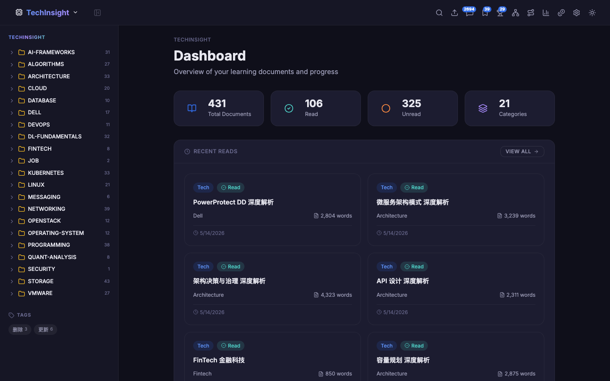
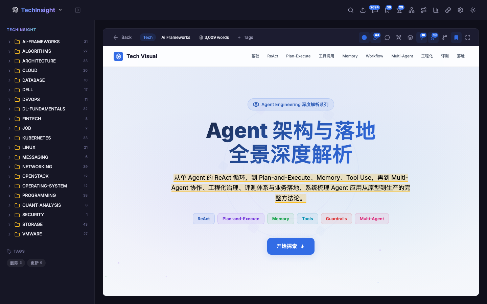
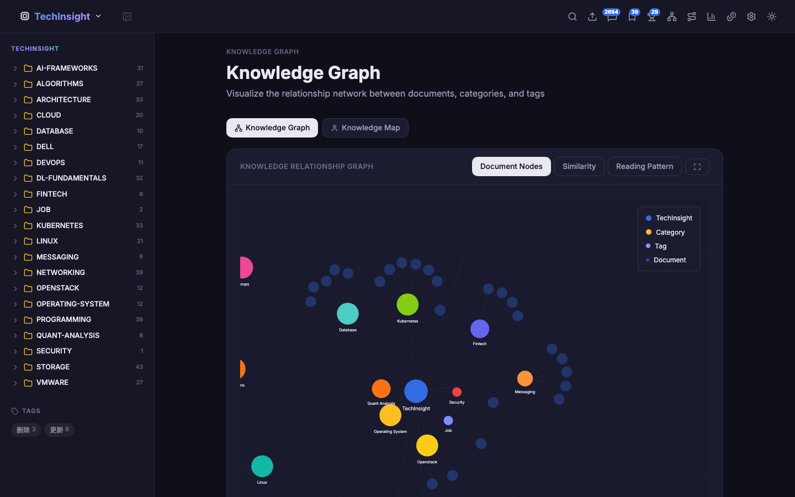
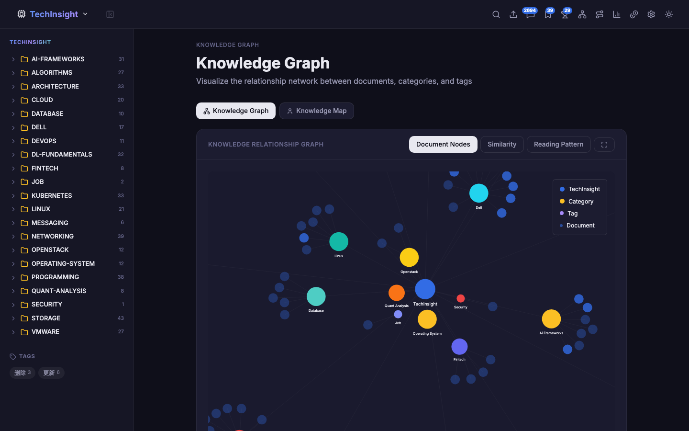
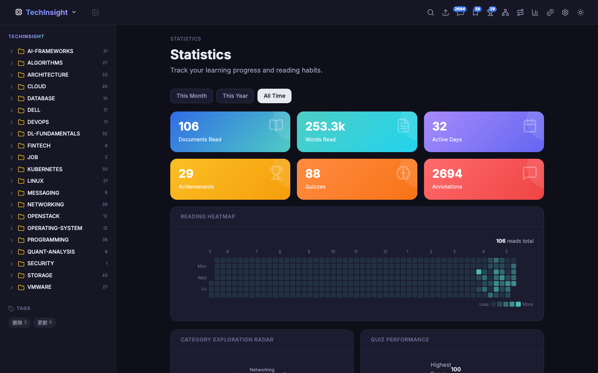
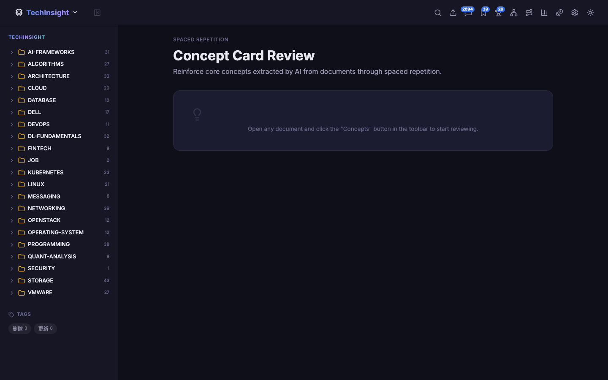
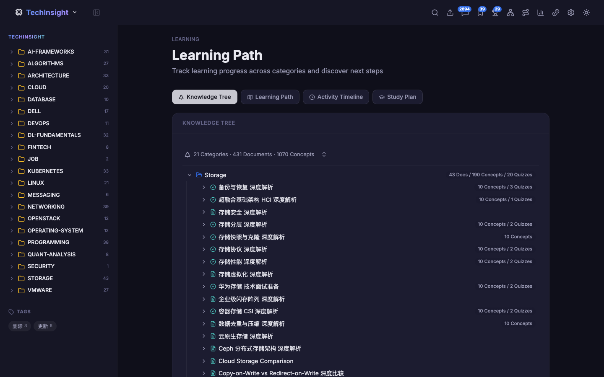
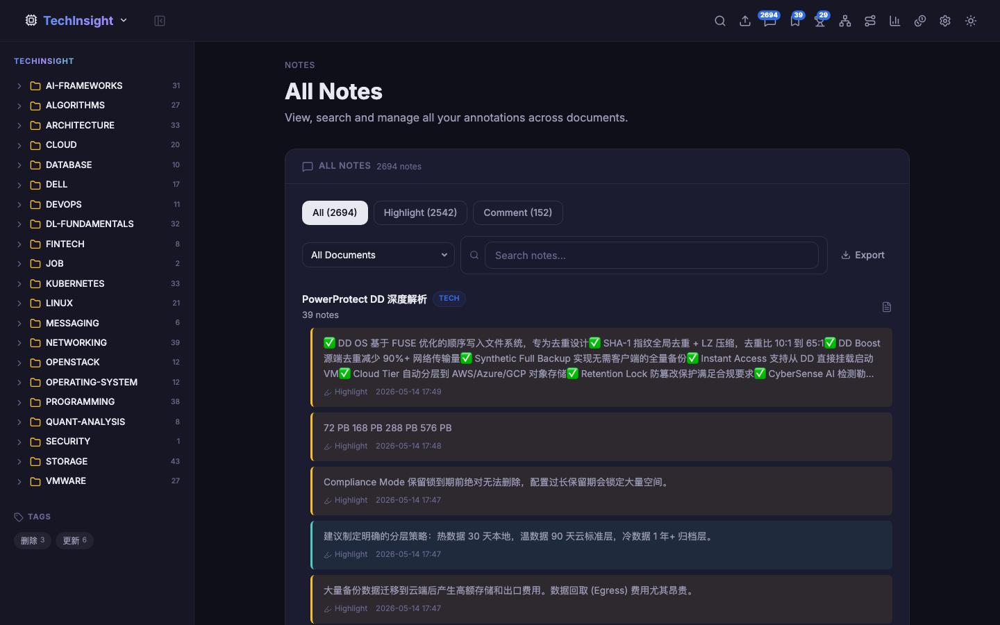

# InsightHub

An intelligent knowledge management platform for browsing, annotating, and mastering HTML learning documents. Powered by local LLM integration for AI-generated quizzes, document chat, and concept extraction, with rich interactive visualizations and science-backed spaced repetition.

## Screenshots

<p align="center">
  
  
</p>
<p align="center">
  <em>Home Dashboard</em> — stats, recent reads, and category overview<br/>
  <em>Document Reader</em> — iframe embed with annotation highlights and AI panels
</p>

<p align="center">
  
  
</p>
<p align="center">
  <em>Knowledge Graph</em> — interactive D3-force document network<br/>
  <em>Personal Map</em> — your knowledge landscape, color-coded by mastery
</p>

<p align="center">
  
  
</p>
<p align="center">
  <em>Learning Analytics</em> — heatmap, radar, quiz dashboard, token usage<br/>
  <em>Spaced Repetition</em> — AI flashcards with SM-2 scheduling
</p>

<p align="center">
  
  
</p>
<p align="center">
  <em>Learning Path</em> — milestones with progress and recommendations<br/>
  <em>Notes</em> — all annotations grouped by document
</p>

## Highlights

### AI-Powered Learning

InsightHub integrates with any OpenAI-compatible local LLM to bring intelligence directly into your reading workflow:

- **AI Quiz Generation** — Generate a complete quiz session on the fly. The LLM analyzes document content and produces multiple-choice and true/false questions via SSE streaming, with questions appearing in real-time. Supports configurable difficulty and question count.

- **AI Document Chat** — Ask questions about the current document and get contextual answers. Supports multi-turn conversation with streaming responses.

- **AI Document Summarization** — Get a structured summary with one click. The AI extracts core takeaways, key concepts, and a content outline.

- **AI Inception (Progressive Summary)** — Multi-level progressive summarization that distills a document from full content to increasingly concise abstracts.

- **AI Concept Extraction** — Automatically extract key concepts from documents and generate spaced repetition flashcards.

- **AI Study Plan** — Paste a job description or learning goal, and the AI matches relevant documents from your library to create a personalized study plan.

- **AI Answer Grading** — Short-answer quiz questions are graded by the LLM with detailed feedback.

- **Token Usage Tracking** — Monitor AI token consumption across all features with cost estimation for commercial LLMs (GPT-4o, Claude, DeepSeek).

- **Privacy-First** — All AI features run against a local model. No data leaves your machine. Works with llama.cpp, Ollama, vLLM, or any OpenAI-compatible server.

### Interactive Visualizations

InsightHub turns your learning data into actionable visual insights:

- **Knowledge Graph** — A force-directed network graph where documents, categories, and tags are nodes connected by relationships. Pan, zoom, and drag to explore. Built with D3-force simulation.
- **Personal Knowledge Map** — A force-directed graph centered on "You", showing your personal knowledge landscape. Node size reflects engagement depth. Color-coded mastery levels from red (needs work) to cyan (mastered).
- **Knowledge Tree** — A collapsible tree view organizing content by Category → Document → Concept.
- **GitHub-Style Reading Heatmap** — Track daily reading activity over time.
- **Category Radar Chart** — A radar/spider chart showing reading distribution across categories.
- **Quiz Performance Dashboard** — Circular gauge for average score, difficulty distribution, and score trend line chart.
- **Reading Habits Analysis** — Hourly distribution, weekday patterns, and streak tracking.
- **Tag Cloud** — Dynamic word cloud where tag size reflects usage frequency.
- **Learning Path** — Timeline of learning milestones with recommended next steps.

### Spaced Repetition

Turn your highlights and comments into durable knowledge:

- Annotations are **automatically converted** into flashcards — highlights become fill-in-the-blank cards, comments become Q&A cards.
- Reviews are scheduled using the **SM-2 algorithm** (SuperMemo 2), the same proven algorithm behind Anki.
- Intervals grow from 1 day → 6 days → 17 days → 49 days → ... based on your recall performance.
- Concept cards extracted by AI are also scheduled for review.
- 3D flip card animation with keyboard shortcuts (Space to flip, 0-5 to grade, S to skip).

### Rich Annotation System

- **Highlight** text in 6 colors with persistent overlays that survive page reloads.
- **Comment** on any selection with threaded replies.
- **Click-to-view** — Click any highlighted passage to see its annotation in a popup.
- Annotations are serialized via XPath and restored with fuzzy text matching as fallback.
- All annotations are synced across LAN clients.

## Feature Overview

| Category | Features |
|----------|----------|
| **Document Management** | Category browsing, full-text search (FlexSearch), tag filtering, read-later list, document import, cross-document navigation |
| **AI Integration** | Quiz generation (SSE streaming), document chat, summarization, inception, concept extraction, study plan, AI grading, token usage tracking |
| **Annotations** | Multi-color highlights, inline comments with replies, click-to-view popup, XPath persistence with fuzzy restore |
| **Spaced Repetition** | Auto flashcard generation from annotations and AI concepts, SM-2 scheduling, 3D flip cards, keyboard shortcuts, progress tracking |
| **Visualizations** | Knowledge graph, personal map, knowledge tree, reading heatmap, category radar, quiz dashboard, reading habits, tag cloud, learning path |
| **Gamification** | Achievement system with 20+ unlockable milestones, toast notifications |
| **Data & Sync** | localStorage persistence, LAN sync via REST API, workspace isolation |
| **UI/UX** | Light/dark theme, responsive sidebar, keyboard shortcuts, iframe-based document reader, feature toggles |

## Tech Stack

| Layer | Technology | Purpose |
|-------|-----------|---------|
| Framework | React 19 + TypeScript | UI and type safety |
| Build | Vite 8 | Dev server and bundling with code splitting |
| State | Zustand 5 | Lightweight reactive state |
| Search | FlexSearch | Client-side full-text search |
| Charts | Recharts | Statistical charts (radar, heatmap, line, bar, area) |
| Graph | D3-force | Force-directed graph layouts |
| Icons | Lucide React | Consistent icon system |
| Styling | Pure CSS + Custom Properties | Theming without dependencies |
| AI | OpenAI-compatible SSE | Local LLM integration |

**Zero UI framework dependencies** — no Material UI, no Tailwind, no Bootstrap. Every component is hand-crafted with pure CSS for full control over the design system.

## Quick Start

### Prerequisites

- Node.js >= 18
- A local LLM server (optional, for AI features)

### Install & Run

```bash
cd insighthub
npm install
npm run dev
```

Open `http://localhost:5600`. Document source directories must exist at the paths configured in `vite.config.ts`.

> **Without a local LLM**, the app works fully — browsing, search, annotations, flashcards, and all visualizations function normally. Only AI features require an LLM server.

### Production Build

```bash
npm run build    # Copies documents into public/docs/, type-checks, and bundles
npm run preview  # Serve the production build locally
```

## Project Structure

```
insighthub/
├── src/
│   ├── components/
│   │   ├── DocReader/           # Annotation bar, panel, popup, summary/chat/AI panels
│   │   ├── Layout/              # App shell, sidebar with workspace switching
│   │   ├── visualization/       # 12 interactive visualization components
│   │   │   ├── KnowledgeGraph   #   Force-directed document/category/tag graph
│   │   │   ├── PersonalMap      #   Personal knowledge landscape graph
│   │   │   ├── KnowledgeTree    #   Collapsible category→doc→concept tree
│   │   │   ├── LearningPath     #   Timeline with milestone cards + AI study plan
│   │   │   ├── CategoryRadar    #   Radar chart for category coverage
│   │   │   ├── ReadingHeatmap   #   GitHub-style daily activity heatmap
│   │   │   ├── QuizPerformance  #   Score gauge + trend + difficulty chart
│   │   │   ├── ReadingHabits    #   Hourly/weekday distribution + streaks
│   │   │   ├── TagCloud         #   Frequency-based word cloud
│   │   │   ├── TopEngaged       #   Ranked engagement list
│   │   │   └── ReportHero       #   Summary hero cards for stats page
│   │   ├── stats/               # Chart containers and stat components
│   │   └── shared/              # Reusable UI components (DocCard, FilterBar, etc.)
│   ├── pages/
│   │   ├── HomePage.tsx         # Dashboard
│   │   ├── CategoryPage.tsx     # Category listing + doc grid
│   │   ├── DocReaderPage.tsx    # Document reader with all AI panels
│   │   ├── SearchPage.tsx       # Full-text search
│   │   ├── QuizPage.tsx         # AI quiz session
│   │   ├── StatsPage.tsx        # Learning analytics
│   │   ├── KnowledgeGraphPage.tsx # Tabbed: graph / personal map
│   │   ├── LearningPathPage.tsx # Tabbed: tree / milestones / timeline / study plan
│   │   ├── SpacedRepetitionPage.tsx # SM-2 flashcard review
│   │   ├── TokenStatsPage.tsx   # AI token usage and cost estimation
│   │   └── ...
│   ├── services/
│   │   ├── aiService.ts         # SSE streaming, quiz gen, summarization, grading
│   │   ├── readerAiService.ts   # Document chat, explain, translate, inception
│   │   ├── conceptService.ts    # AI concept extraction
│   │   ├── studyPlanService.ts  # AI study plan generation
│   │   ├── tokenUsageService.ts # Token usage tracking
│   │   ├── spacedRepetition.ts  # SM-2 algorithm, card creation
│   │   ├── similarityService.ts # TF-IDF document similarity
│   │   └── achievementService.ts # Achievement definitions
│   ├── stores/                  # 9 Zustand stores
│   ├── utils/                   # XPath, graph builders, aggregators, markdown renderer
│   └── styles/                  # 7 CSS files (globals, layout, components, etc.)
├── vite-plugins/                # Custom Vite plugin (document discovery + API proxy)
└── vite.config.ts
```

## Configuration

### AI Model

Configure from the Settings page or `vite.config.ts`:

```typescript
documentDiscovery({
  aiApiUrl: 'http://127.0.0.1:7001/v1',
  aiModel: 'Qwen/Qwen3.5-27B-4bit',
})
```

Compatible with any OpenAI-compatible server: llama.cpp, Ollama, vLLM, LM Studio, etc.

### Document Sources

Three knowledge bases, each with multiple categories:

| Workspace | Prefix | Categories |
|-----------|--------|-----------|
| **MindInsight** | `mi-` | Academic, History, Finance, Literature, Media Analysis, Philosophy, Pop Culture |
| **TechInsight** | `ti-` | AI Frameworks, Algorithms, Cloud, Database, DevOps, K8s, Linux, Networking, Programming, Security, VMware, and more |
| **LeetCodeInsight** | `li-` | Arrays, Strings, Linked List, Stack, Math, Dynamic Programming, Binary Search |

### Workspace Switching

Toggle between workspaces from the navbar. Each workspace independently filters documents, annotations, flashcards, tags, and sidebar navigation. Custom workspaces can be added in Settings.

### Feature Toggles

Individual AI features can be enabled/disabled from Settings: Summary, Evaluation, Inception, Speech, Script, Quiz, Concept Extraction, Similarity Edges, and more.

## Documentation

- [DESIGN.md](docs/DESIGN.md) — Technical design, architecture, data flow, algorithms
- [DEPLOY.md](docs/DEPLOY.md) — Build, deployment options (static, LAN, Docker), AI setup

## License

Private project.
