# InsightHub

An intelligent knowledge management platform for browsing, annotating, and mastering HTML learning documents. Powered by local LLM integration for AI-generated quizzes, document chat, concept extraction, and study plans, with rich interactive visualizations and science-backed spaced repetition.

## Highlights

### AI-Powered Learning

InsightHub integrates with any OpenAI-compatible local LLM to bring intelligence directly into your reading workflow:

- **AI Quiz Generation** — Generate quiz sessions with 5 question types via SSE streaming: multiple-choice, true/false, short-answer, fill-in-the-blank, and code completion. Configurable difficulty and question count.
- **AI Document Chat** — Multi-turn conversation about document content with streaming responses.
- **AI Document Summarization** — Structured summary with core takeaways, key concepts, and content outline.
- **AI Evaluation** — Assess document accuracy, completeness, and depth with AI-generated ratings.
- **AI Inception (Progressive Summary)** — Multi-level distillation from full content to increasingly concise abstracts.
- **AI Concept Extraction** — Auto-extract key concepts from documents and generate spaced repetition flashcards.
- **AI Concept Challenges** — Devil's advocate multi-round debates that test deep understanding with scoring.
- **AI Code Editor** — Built-in CodeMirror editor with AI coaching, syntax highlighting for 15+ languages, and code execution.
- **AI Whiteboard** — Drawing canvas with AI vision analysis to interpret diagrams and handwritten notes.
- **AI Study Plan** — Paste a job description or learning goal, and the AI matches relevant documents to create a personalized plan.
- **AI Bubble** — Hover over any concept to get an instant AI explanation popover.
- **Token Usage Tracking** — Monitor AI token consumption with cost estimation for commercial LLMs.
- **Privacy-First** — All AI features run against a local model. No data leaves your machine.

### Interactive Visualizations

- **Knowledge Graph** — D3-force network graph with pan, zoom, and drag. Similarity edges via TF-IDF cosine similarity.
- **Personal Knowledge Map** — Force-directed graph centered on "You" with engagement-based node sizing and mastery color coding.
- **Knowledge Tree** — Collapsible tree: Category → Document → Concept.
- **GitHub-Style Reading Heatmap** — Daily reading activity over time.
- **Category Radar Chart** — Reading distribution across categories.
- **Quiz Performance Dashboard** — Circular gauge, difficulty distribution, and score trend.
- **Reading Habits Analysis** — Hourly, weekday patterns, and streak tracking.
- **Tag Cloud** — Dynamic word cloud sized by usage frequency.
- **Learning Path** — Timeline of milestones with AI-generated study recommendations.

### Spaced Repetition

- Concept cards auto-generated by AI from document content.
- **SM-2 algorithm** (SuperMemo 2) scheduling — the same algorithm behind Anki.
- Intervals: 1 day → 6 days → 17 days → 49 days → ... based on recall performance.
- 3D flip animation with keyboard shortcuts (Space to flip, 0-5 to grade, S to skip).

### Rich Annotation System

- **Highlight** text in 6 colors with persistent overlays.
- **Comment** on any selection with threaded replies.
- **Click-to-view** — Click highlighted passages to see annotation details.
- **Touch support** — Full annotation on iPad and touch devices.
- XPath serialization with fuzzy text matching restore.
- LAN sync across clients.

### Achievement System

48 achievements across 5 categories:

- **Reading** (11) — First Read → Million Words
- **Quiz** (10) — First Quiz → Question Crusher
- **Annotation** (9) — First Highlight → Conversation King
- **Streak & Explore** (9) — Three-Day Streak → Search Savant
- **Special** (8) — Speed Reader, AI Scholar, and more

## Feature Overview

| Category | Features |
|----------|----------|
| **Document Management** | Category browsing, full-text search (FlexSearch), tag filtering, read-later, document import (HTML/URL), cross-document navigation, hide & restore, trash |
| **AI Integration** | Quiz (5 types, SSE streaming), chat, summarization, evaluation, inception, concept extraction, challenges, code editor with coaching, whiteboard with vision, study plan, AI bubble, token tracking |
| **Annotations** | 6-color highlights, threaded comments, click-to-view popup, touch support, XPath persistence with fuzzy restore |
| **Spaced Repetition** | AI concept cards, SM-2 scheduling, 3D flip cards, keyboard shortcuts |
| **Visualizations** | Knowledge graph, personal map, knowledge tree, heatmap, radar, quiz dashboard, reading habits, tag cloud, learning path |
| **Gamification** | 48 achievements across 5 categories, toast notifications |
| **Data & Sync** | localStorage persistence, LAN sync via REST API, workspace isolation, backup/export/import |
| **UI/UX** | Light/dark theme, sidebar, keyboard shortcuts, iframe reader, feature toggles, multi-profile AI config |

## Screenshots

### Overview & Navigation

<p align="center">
  
  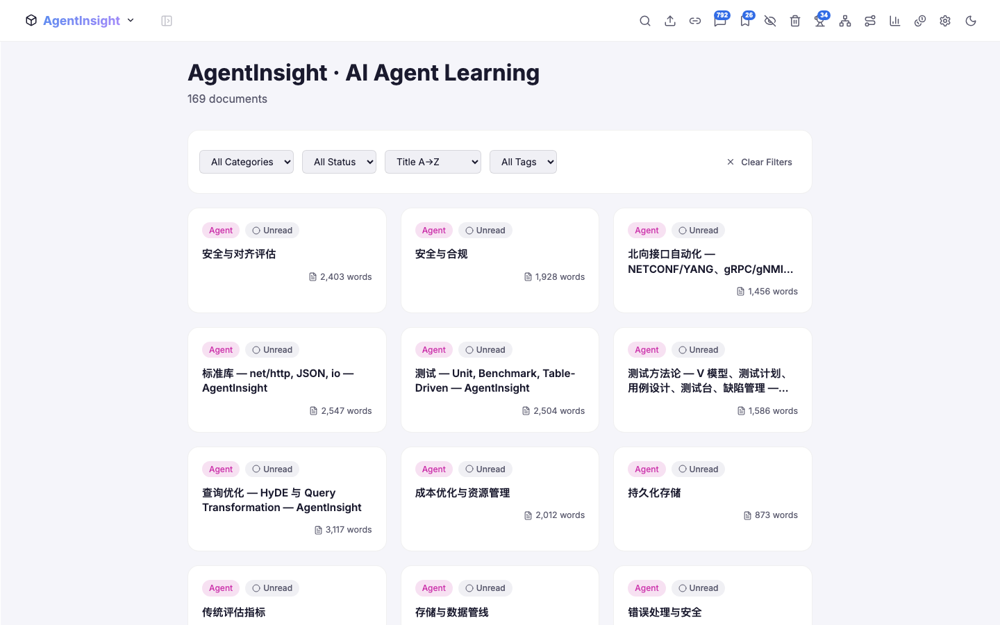
</p>
<p align="center">
  <em>Home Dashboard</em> — reading stats, category overview, and recent activity<br/>
  <em>Category Browsing</em> — filter documents by workspace and category
</p>

### AI-Powered Document Reader

<p align="center">
  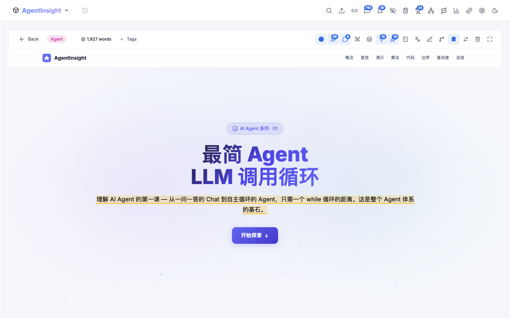
  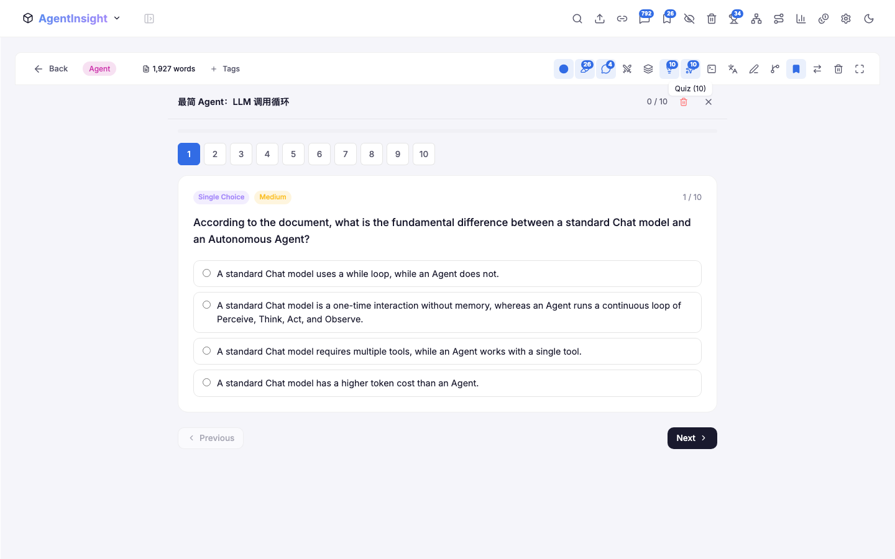
</p>
<p align="center">
  <em>Document Reader</em> — iframe-embedded documents with a full annotation and AI toolbar<br/>
  <em>AI Quiz</em> — auto-generated quiz sessions with 5 question types, difficulty tags, and score tracking
</p>

<p align="center">
  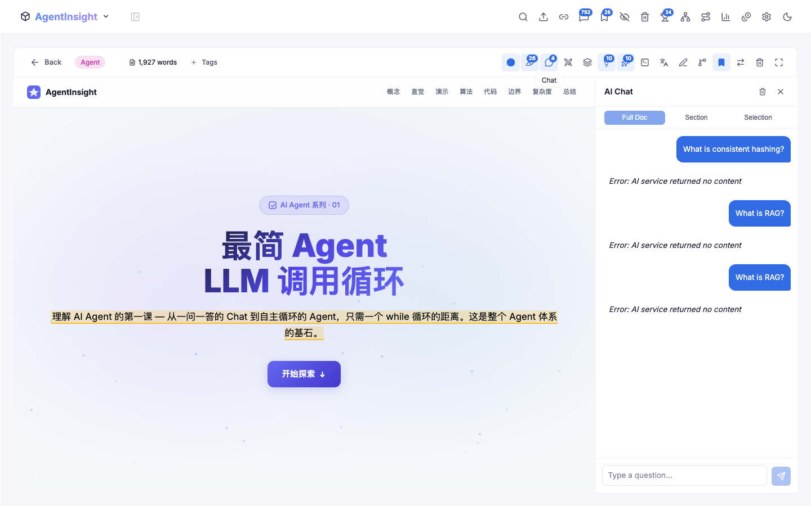
  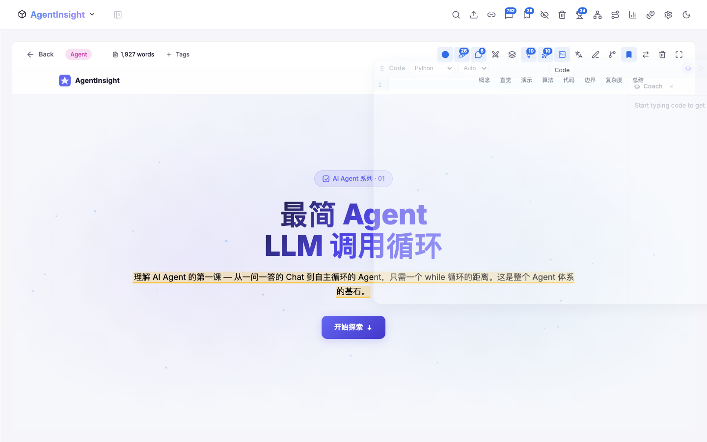
</p>
<p align="center">
  <em>AI Chat</em> — multi-turn conversation about document content with streaming responses<br/>
  <em>Code Editor</em> — built-in CodeMirror editor with AI coaching panel and multi-language support
</p>

<p align="center">
  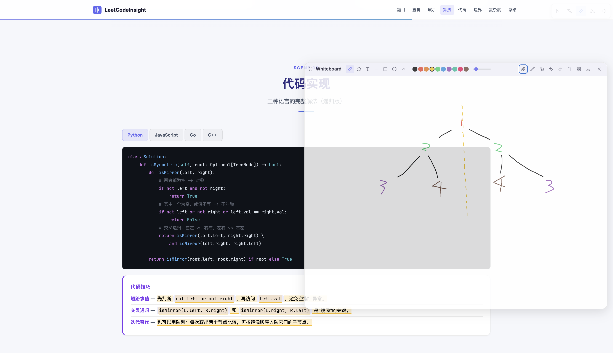
  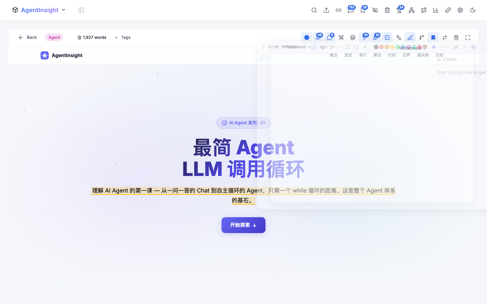
</p>
<p align="center">
  <em>Whiteboard</em> — freehand drawing canvas for visual note-taking alongside documents<br/>
  <em>AI Summary</em> — one-click structured summary with key takeaways, concepts, and outline
</p>

<p align="center">
  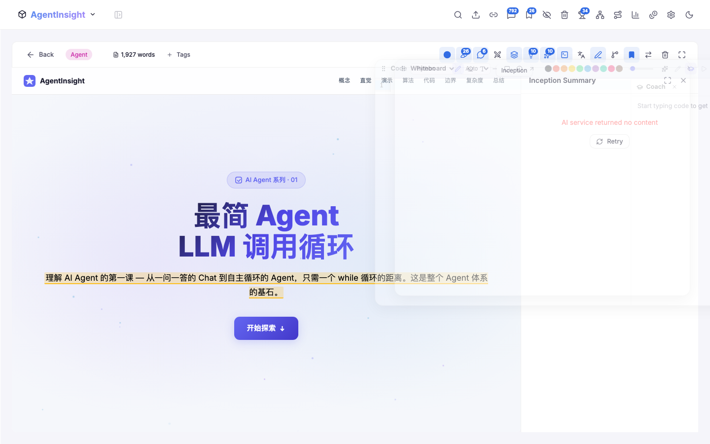
  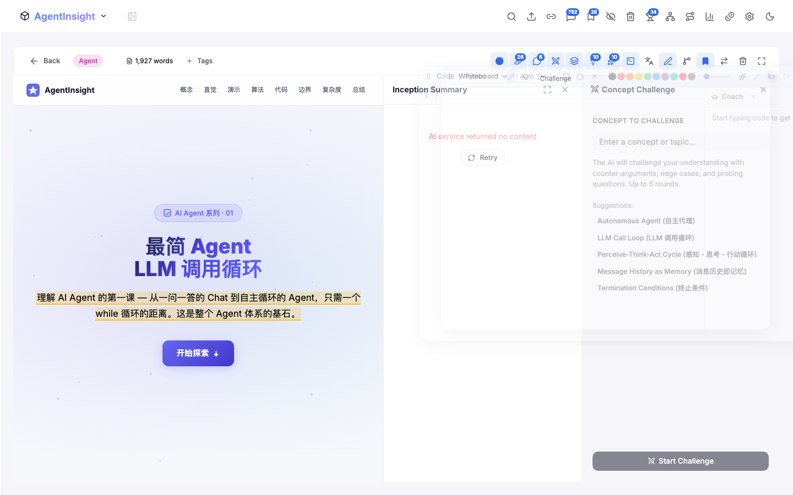
</p>
<p align="center">
  <em>AI Inception</em> — progressive multi-level summarization from full content to abstract<br/>
  <em>AI Challenge</em> — devil's advocate multi-round debates to test concept understanding
</p>

<p align="center">
  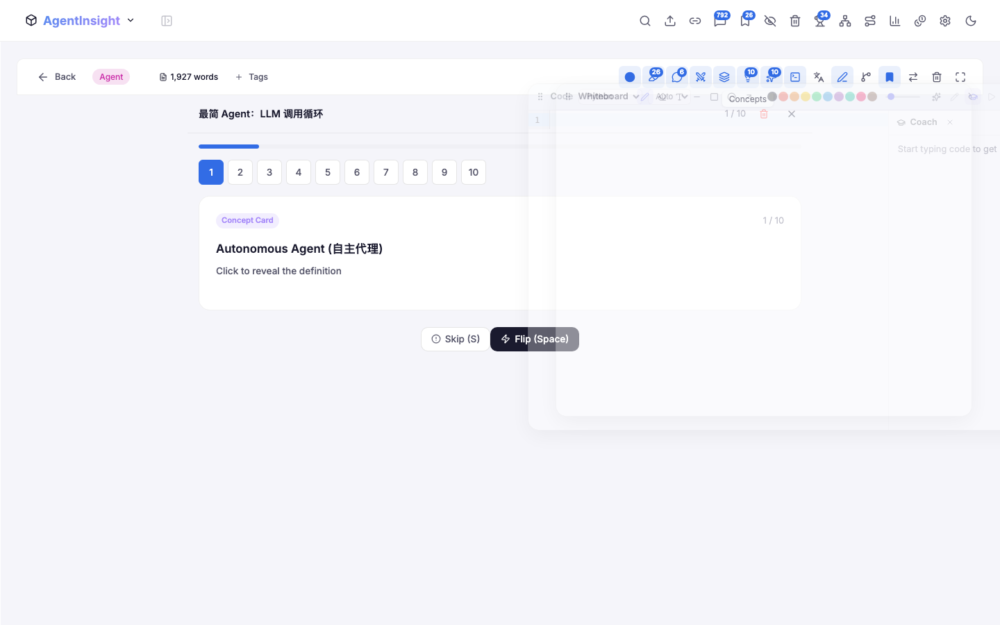
</p>
<p align="center">
  <em>Concept Extraction</em> — AI-generated concept cards for spaced repetition review
</p>

### Visualizations & Analytics

<p align="center">
  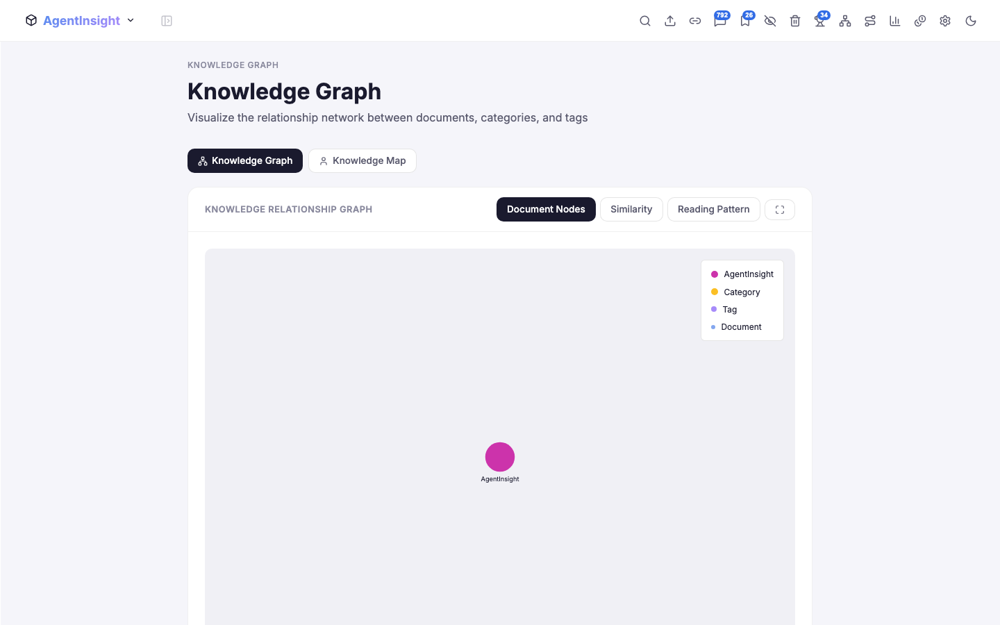
  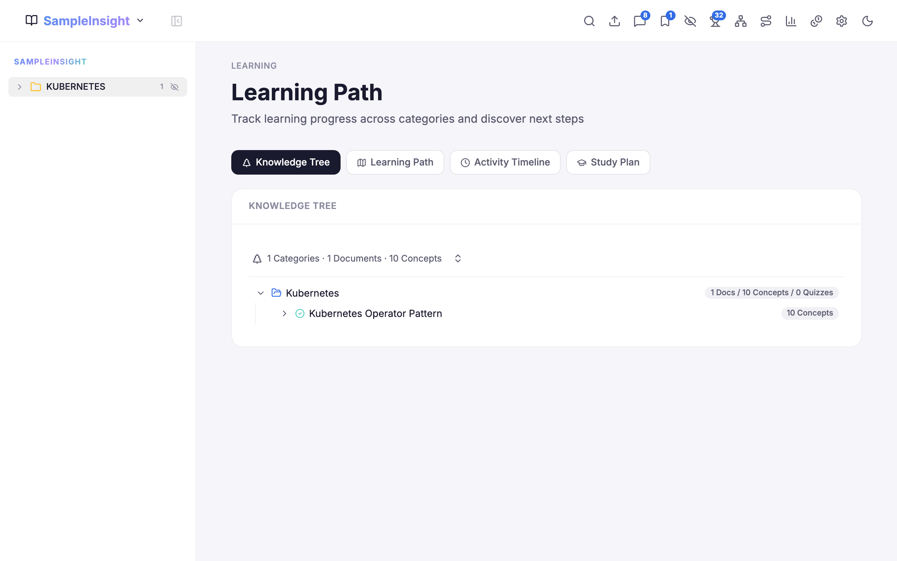
</p>
<p align="center">
  <em>Knowledge Graph</em> — interactive D3-force network of documents, categories, and tags<br/>
  <em>Learning Path</em> — knowledge tree with milestones and AI study plan
</p>

<p align="center">
  
  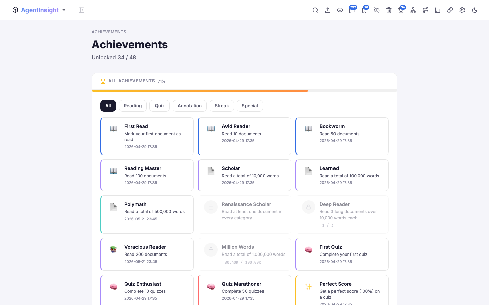
</p>
<p align="center">
  <em>Learning Analytics</em> — reading heatmap, quiz performance, category radar, and habits<br/>
  <em>Achievements</em> — 44 unlockable milestones across 5 categories
</p>

### More

<p align="center">
  
  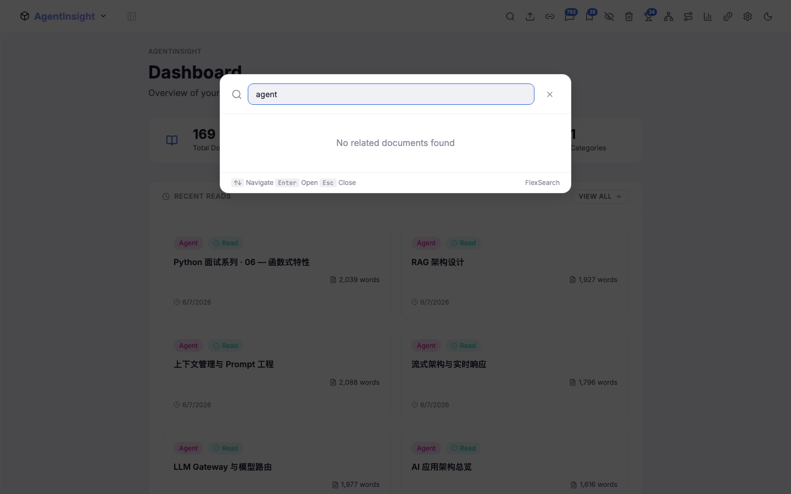
</p>
<p align="center">
  <em>Spaced Repetition</em> — SM-2 algorithm flashcard review with 3D flip animation<br/>
  <em>Full-Text Search</em> — instant FlexSearch across all documents with keyboard shortcut
</p>

<p align="center">
  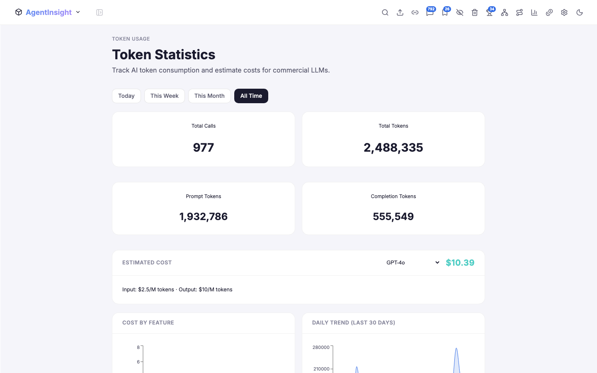
  
</p>
<p align="center">
  <em>Token Stats</em> — AI token usage tracking with cost estimation per model<br/>
  <em>All Notes</em> — unified view of all comments and annotations across documents
</p>

## Tech Stack

| Layer | Technology | Purpose |
|-------|-----------|---------|
| Framework | React 19 + TypeScript | UI and type safety |
| Build | Vite 8 | Dev server and bundling with code splitting |
| State | Zustand 5 | Lightweight reactive state (7 stores) |
| Search | FlexSearch | Client-side full-text search |
| Editor | CodeMirror 6 | Code editing with syntax highlighting |
| Charts | Recharts | Statistical charts (radar, heatmap, line, bar) |
| Graph | D3-force | Force-directed graph layouts |
| Icons | Lucide React | Consistent icon system |
| Styling | Pure CSS + Custom Properties | Theming without dependencies |
| Fonts | Inter Variable, JetBrains Mono | UI and code fonts |
| AI | OpenAI-compatible SSE | Local LLM integration |

**Zero UI framework dependencies** — no Material UI, no Tailwind, no Bootstrap. Every component is hand-crafted with pure CSS.

## Quick Start

### Prerequisites

- Node.js >= 18
- A local LLM server (optional, for AI features)

### Install & Run

```bash
cd insighthub
npm install
npm run dev
```

Open `http://localhost:5600`. Add your document workspaces from the Settings page or by editing `data/.insighthub-workspaces.json`.

> **Without a local LLM**, the app works fully — browsing, search, annotations, and all visualizations function normally. Only AI features (quiz, chat, concept extraction, etc.) require an LLM server.

### Testing

```bash
npm run test      # Unit tests (Vitest, jsdom)
npm run test:e2e  # E2E smoke tests (Playwright; spawns the dev server on :5600)
npm run test:all  # Both
```

E2E tests adapt to your setup: document-dependent flows (doc reader, search results) are skipped automatically when no document workspaces are configured, and no local LLM is required.

### Production Build

```bash
npm run build    # Copies documents into public/docs/, type-checks, and bundles
npm run preview  # Serve the production build locally
```

## Project Structure

```
insighthub/
├── src/
│   ├── components/
│   │   ├── DocReader/           # 19 components for document reader
│   │   │   ├── AnnotationBar    #   Highlight/comment toolbar
│   │   │   ├── AnnotationPanel  #   Annotation list sidebar
│   │   │   ├── AnnotationPopup  #   Click-to-view annotation details
│   │   │   ├── CommentDialog    #   Comment editing dialog
│   │   │   ├── ChatPanel        #   AI multi-turn document chat
│   │   │   ├── SummaryPanel     #   AI document summarization
│   │   │   ├── EvaluationPanel  #   AI document evaluation
│   │   │   ├── InceptionPanel   #   AI progressive summarization
│   │   │   ├── ChallengePanel   #   AI concept challenges (5 rounds)
│   │   │   ├── ScriptPanel      #   AI presentation script
│   │   │   ├── QuizPanel        #   AI quiz session
│   │   │   ├── ConceptCardsPanel#   AI-extracted concept cards
│   │   │   ├── SimilarDocsPanel #   Document similarity sidebar
│   │   │   ├── AIBubble         #   Hover concept explanation
│   │   │   ├── CodeEditorPanel  #   CodeMirror editor with AI coaching
│   │   │   ├── WhiteboardPanel  #   Drawing canvas with AI vision
│   │   │   ├── ShadowTypingPanel#   Shadow typing practice
│   │   │   ├── RatingDialog     #   Document rating dialog
│   │   │   └── WikiLinkRenderer #   Wiki-style bidirectional links
│   │   ├── Layout/              # App shell, sidebar, navbar, file tree
│   │   ├── visualization/       # 12 interactive visualization components
│   │   ├── stats/               # Chart containers and stat components
│   │   ├── shared/              # Reusable UI (DocCard, DocGrid, FilterBar, etc.)
│   │   ├── Import/              # Import, move, and URL import dialogs
│   │   └── search/              # Search dialog
│   ├── pages/                   # 16 page components
│   ├── services/                # 13 service modules
│   ├── stores/                  # 7 Zustand stores
│   ├── hooks/                   # 6 custom hooks
│   ├── utils/                   # XPath, graph builders, aggregators, exporters
│   ├── types/                   # Centralized TypeScript type definitions
│   └── styles/                  # 7 CSS files (globals, layout, components, etc.)
├── vite-plugins/                # Custom Vite plugin (document discovery + 36 API endpoints)
├── scripts/
│   └── copy-docs.ts             # Build-time document copy script
└── vite.config.ts
```

## Configuration

### AI Model

Configure from the Settings page — supports multiple AI model profiles with full CRUD. Compatible with any OpenAI-compatible server: llama.cpp, Ollama, vLLM, LM Studio, etc.

### Document Workspaces

Workspaces are configured in `data/.insighthub-workspaces.json` or added via Settings. Each workspace maps to a local directory with its own ID prefix. Categories are discovered dynamically from the folder structure.

```json
[
  {
    "id": "mydocs",
    "label": "MyDocuments",
    "icon": "BookOpen",
    "path": "../MyDocuments",
    "prefix": "my",
    "subtitle": "My Knowledge Base"
  }
]
```

### Workspace Switching

Toggle between workspaces from the navbar. Each workspace independently filters documents, annotations, flashcards, tags, and sidebar navigation.

### Feature Toggles

Individual AI features can be enabled/disabled from Settings. Disabling a feature only hides its button — existing data is preserved.

### Data Management

Full data backup and restore: export all data (localStorage + server endpoints) as a single JSON file, and import to restore on any machine.

### Quiz Configuration

Configure difficulty (easy/medium/hard), question count, and enabled question types (multiple-choice, true/false, short-answer, fill-in-the-blank, code completion).

## Documentation

- [Architecture (架构文档)](docs/ARCHITECTURE.md) — overall architecture with four interactive diagrams (system overview, startup pipeline, AI request sequence, persistence & LAN sync)
- [Technical Design](docs/DESIGN.md) — design decisions, key algorithms (SM-2, XPath annotation serialization), state management patterns
- [Deployment Guide](docs/DEPLOY.md) — build, workspace configuration, and deployment

## License

[MIT](LICENSE)
